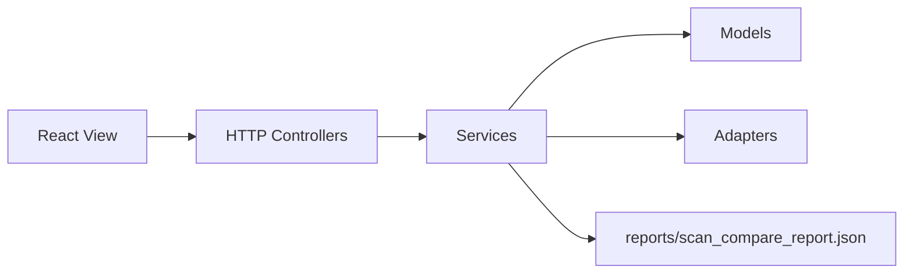

# VulnMngSys - Windows Server Configuration Vulnerability Scanner

VulnMngSys scans Windows Server machines for configuration misconfigurations using CIS Benchmark rules and runs locally with Administrator privileges.

## Scope

- Account Policy (`secedit`)
- User Rights Assignment (`secedit /areas USER_RIGHTS`)
- Security Options / Registry
- Advanced Audit Policy (`auditpol`)
- Per-user rules under HKU
- IIS Metasploit audit modules

Not included: CVE database management or remote enterprise orchestration.

## Architecture

The project uses MVC naming for the Python desktop backend:

- View: `react-ui/src` renders the UI; packaged static files live in `vulnmngsys_app/views/dist`.
- Controller: `vulnmngsys_app/controllers` exposes local HTTP endpoints.
- Model: `vulnmngsys_app/models` contains rule/result models and checker contracts.
- Service: `vulnmngsys_app/services` contains scan, report, remediation, and rule workflows.
- Adapter: `vulnmngsys_app/adapters` contains Windows, registry, PowerShell, rule repository, and backup adapters.
- Startup: `vulnmngsys_app/startup` contains CLI parsing and privilege checks.

Controllers call services; services depend on model contracts; adapters implement the Windows-specific details.



## Requirements

- Windows Server 2016 / 2019 / 2022
- Python 3.10+
- PowerShell 5.1+
- Administrator privileges

## Development Run

```powershell
python main.py
```

CLI:

```powershell
python main.py --cli
```

Validate the rule/scan/report contract:

```powershell
python scripts\validate_scan_standards.py
```

## Build UI + EXE

```powershell
cd react-ui
npm install
npm run build
cd ..
.\build_windows.ps1
```

## Add a New Rule

Example password policy:

```json
{
  "id": "1.1.1",
  "title": "Enforce password history",
  "type": "secedit",
  "key": "PasswordHistorySize",
  "expected": { "min": 24 },
  "description": "24 or more passwords retained"
}
```

Supported `type` values: `secedit`, `user_right`, `registry`, `user_registry`, `auditpol`, `local_account`.

Manifest: [`rules/Windows_Server_2022_manifest.json`](rules/Windows_Server_2022_manifest.json) - `quick` / `full`.

## Local API

| Endpoint | Description |
|----------|-------------|
| `GET /api/inventory` | OS / profile information |
| `POST /api/scan` | Body: `{ "mode": "quick\|full", "profileKey": "Windows_Server_2022" }` |
| `GET /api/report` | Latest JSON report |
| `GET /api/report/export?format=html` | Export HTML |

## Reports

- JSON: `reports/scan_compare_report.json`
- HTML: `reports/scan_report.html` after export
