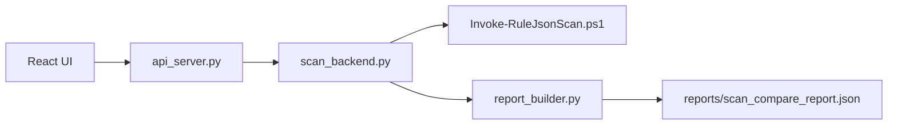

# VulnMngSys — Công cụ phát hiện lỗ hổng cấu hình Windows Server

Ứng dụng quét **misconfiguration** trên máy Windows Server theo bộ rule CIS Benchmark (Windows Server 2022), chạy cục bộ với quyền Administrator.

## Phạm vi

- Account Policy (`secedit`)
- User Rights Assignment (`secedit /areas USER_RIGHTS`)
- Security Options / Registry
- Advanced Audit Policy (`auditpol`)
- Một số rule per-user (HKU)

Không bao gồm: quét mạng, CVE database, Metasploit runtime.

## Kiến trúc



## Yêu cầu

- Windows Server 2016 / 2019 / 2022 (khuyến nghị 2022)
- Python 3.10+
- PowerShell 5.1+
- Quyền Administrator (UAC)

## Chạy phát triển

```powershell
cd VulnMngSys
python main.py
```

CLI:

```powershell
python main.py --cli
```

Xác thực hợp đồng rule/scan/report:

```powershell
python scripts\validate_scan_standards.py
```

## Build giao diện + EXE

```powershell
cd react-ui
npm install
npm run build
cd ..
.\build_windows.ps1
```

## Thêm rule mới

Ví dụ password policy:

```json
{
  "id": "1.1.1",
  "title": "Enforce password history",
  "type": "secedit",
  "key": "PasswordHistorySize",
  "expected": { "min": 24 },
  "description": "24 or more passwords retained"
}
```

Các `type` hỗ trợ: `secedit`, `user_right`, `registry`, `user_registry`, `auditpol`, `local_account`.

Manifest: [`rules/Windows_Server_2022_manifest.json`](rules/Windows_Server_2022_manifest.json) — `quick` / `full`.

## API cục bộ

| Endpoint | Mô tả |
|----------|--------|
| `GET /api/inventory` | Thông tin OS / profile |
| `POST /api/scan` | Body: `{ "mode": "quick\|full", "profileKey": "Windows_Server_2022" }` |
| `GET /api/report` | Báo cáo JSON gần nhất |
| `GET /api/report/export?format=html` | Xuất HTML |

## Báo cáo

- JSON: `reports/scan_compare_report.json`
- HTML: `reports/scan_report.html` (sau export)
