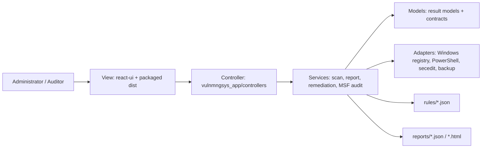
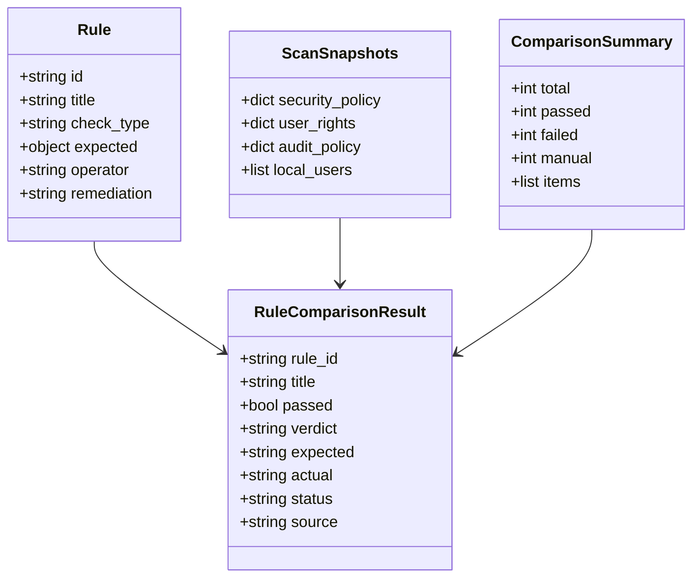
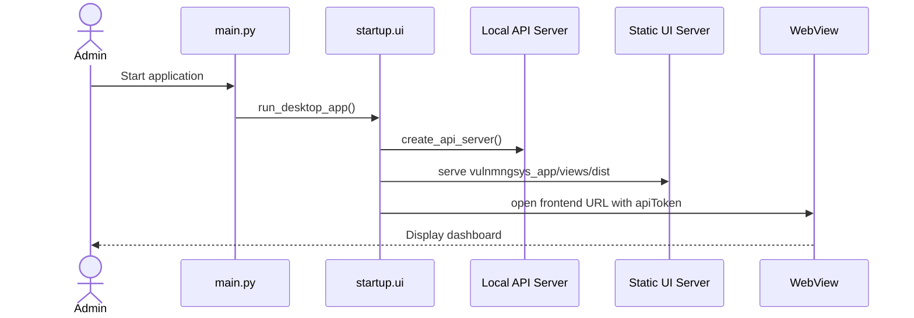
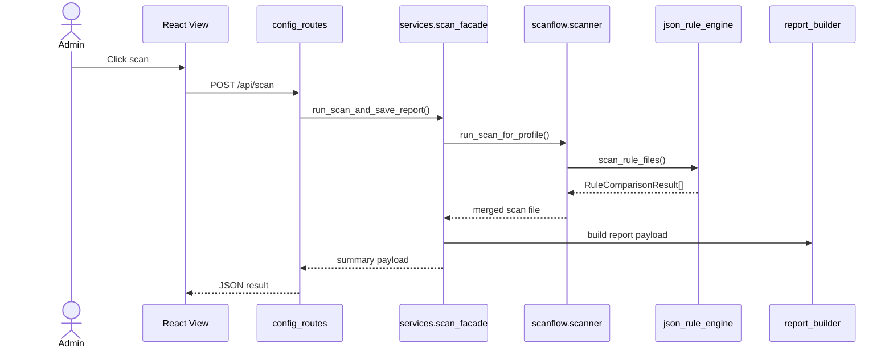
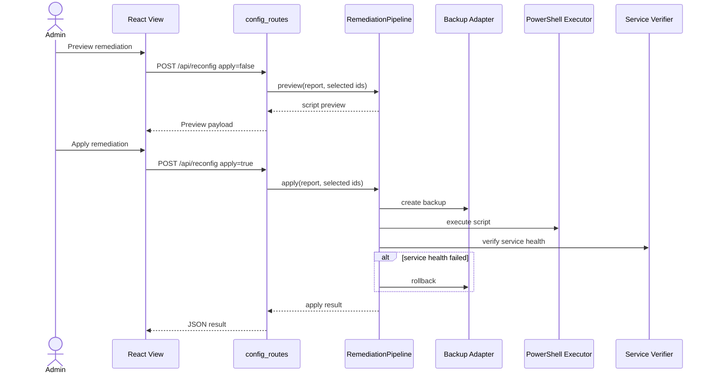
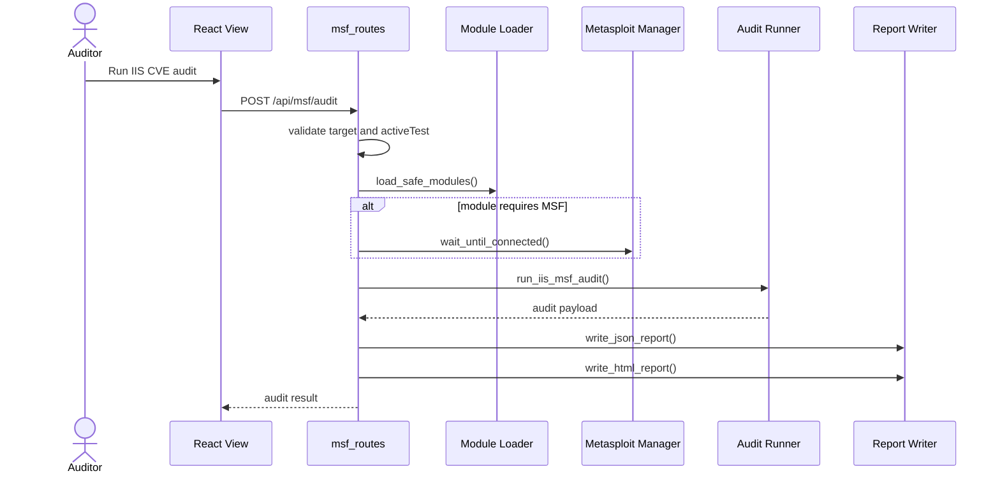
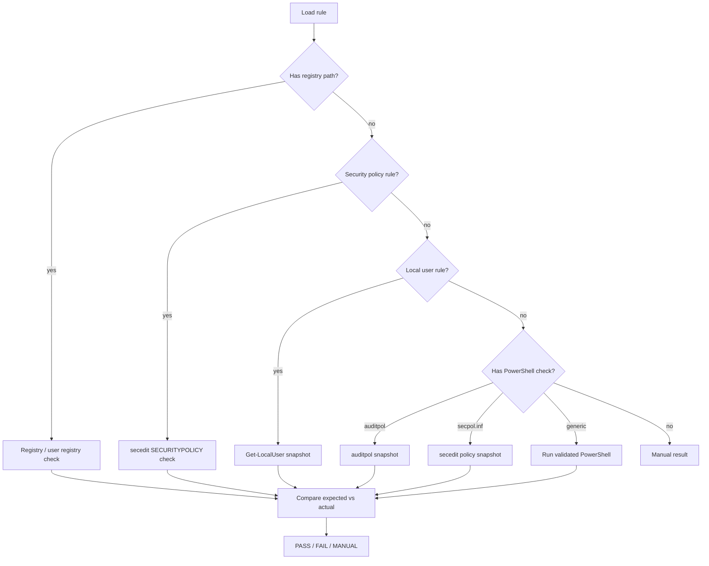

# VulnMngSys Business Analysis and Software Specification

Version: 1.0  
Scope: Windows Server local configuration vulnerability scanning, remediation preview/apply, and focused IIS CVE audit.  
Architecture baseline: MVC package naming with service/adapters for Windows-specific execution.

## 1. Executive Summary

VulnMngSys is a Windows Server security assessment desktop application. It scans local Windows Server configuration against CIS-style JSON rules, reports pass/fail/manual findings, supports remediation preview/apply with rollback safety, and runs focused IIS/Windows Server CVE checks through local PowerShell and optional Metasploit RPC.

The product is intentionally local-first. It does not provide enterprise fleet orchestration, cloud synchronization, or Linux scanning.

## 2. Business Objectives

| ID | Objective | Success Measure |
|----|-----------|-----------------|
| BO-01 | Detect Windows Server misconfiguration quickly | Quick scan produces a report for the detected profile |
| BO-02 | Support audit evidence for reports | JSON and HTML reports contain rule status, evidence, expected value, actual value, and remediation |
| BO-03 | Reduce unsafe manual remediation | Preview script before apply; apply path performs backup and service health checks |
| BO-04 | Keep operation local and controlled | API is localhost/token protected; active MSF tests are restricted by default |
| BO-05 | Keep code explainable for defense | MVC package structure and clear service/adapters boundaries |

## 3. Stakeholders

| Stakeholder | Responsibility | Need |
|-------------|----------------|------|
| System Administrator | Runs scans and applies remediation | Fast local visibility and safe fix workflow |
| Security Auditor | Reviews report evidence | Traceable rule result and exportable report |
| Project Evaluator | Reviews architecture and implementation | Clear MVC, OOP, SOLID, low coupling, high cohesion |
| Developer/Maintainer | Extends rules and checks | JSON rule format, isolated adapters, focused tests |

## 4. System Boundary

In scope:

- Windows Server 2016/2019/2022 configuration scan.
- CIS-style rule loading from local JSON files.
- Registry, secedit, auditpol, local user, and PowerShell-based checks.
- Local HTTP API for desktop UI.
- Remediation preview/apply with rollback support.
- Focused IIS CVE audit through local checks and optional local Metasploit RPC.
- JSON/HTML reports.

Out of scope:

- Linux scanning.
- Remote enterprise scanning/orchestration.
- CVE database management.
- Multi-user SaaS access control.
- Cloud storage or synchronization.

## 5. Architecture Overview



### 5.1 Package Responsibilities

| Package | Role | Allowed Responsibility |
|---------|------|------------------------|
| `vulnmngsys_app/controllers` | MVC Controller | Parse local API requests, call services, return JSON |
| `vulnmngsys_app/views` | MVC View artifact | Packaged frontend static build |
| `react-ui/src` | MVC View source | User interaction and dashboard rendering |
| `vulnmngsys_app/models` | MVC Model | Dataclasses/protocols for rules, results, collectors, checkers |
| `vulnmngsys_app/services` | Business logic | Scan flow, rule evaluation, reports, remediation, MSF audit |
| `vulnmngsys_app/adapters` | Infrastructure adapters | Windows-specific IO and external command access |
| `vulnmngsys_app/startup` | Composition root | CLI/UI/backend entrypoints and dependency assembly |

### 5.2 Design Principles

| Principle | Application |
|-----------|-------------|
| SRP | Controllers route requests; services execute workflows; adapters touch Windows APIs |
| OCP | New rule/check types should extend services/adapters without changing controllers |
| LSP | Checker/collector implementations follow model protocols |
| ISP | Small contracts for collectors/checkers instead of a large shared interface |
| DIP | Services depend on model contracts; startup wires concrete Windows adapters |
| Low coupling | UI calls local API; API calls services; services avoid UI concerns |
| High cohesion | Scan, remediation, reporting, and MSF audit are separate service areas |

## 6. Actors

| Actor | Type | Description |
|-------|------|-------------|
| Administrator | Primary | Runs scan, reviews result, applies remediation |
| Auditor | Primary | Reviews/export reports and evidence |
| Local API | System | Token-protected localhost API serving UI |
| Windows Server | External system | Provides registry, secedit, auditpol, services, local users |
| Metasploit RPC | External optional system | Runs selected IIS CVE checks when available |

## 7. Use Case Catalog

| UC | Name | Primary Actor | Priority |
|----|------|---------------|----------|
| UC-01 | Launch Desktop Application | Administrator | High |
| UC-02 | Detect Windows Server Inventory | Administrator | High |
| UC-03 | Run Configuration Scan | Administrator | High |
| UC-04 | Monitor Scan Progress | Administrator | Medium |
| UC-05 | Review Scan Report | Administrator/Auditor | High |
| UC-06 | Export Report | Auditor | Medium |
| UC-07 | Preview Remediation | Administrator | High |
| UC-08 | Apply Remediation with Rollback | Administrator | High |
| UC-09 | Load Service Tree | Administrator/Auditor | Medium |
| UC-10 | Run Focused IIS CVE Audit | Administrator/Security Auditor | Medium |
| UC-11 | View MSF Runtime Status | Administrator | Medium |
| UC-12 | Use CLI Quick Scan | Administrator | Medium |

## 8. Detailed Use Cases

### UC-01 Launch Desktop Application

Preconditions:

- Application is executed on Windows.
- Frontend build exists under `vulnmngsys_app/views/dist`.

Main flow:

1. User starts `main.py` or packaged EXE.
2. Startup creates local API server.
3. Startup creates local UI static server.
4. Desktop webview opens the frontend URL with API token.

Postconditions:

- UI is visible.
- Local API accepts authorized requests.

Exceptions:

- Missing frontend build returns startup error.
- Missing GUI dependency affects desktop UI only; backend modules remain importable.

### UC-03 Run Configuration Scan

Preconditions:

- User is authorized by local API token.
- Target machine is Windows Server.
- Rule files exist for detected or selected profile.

Main flow:

1. UI posts `/api/scan`.
2. Controller validates action permission.
3. Scan facade loads inventory and rule catalog.
4. Scanner loads JSON rules and snapshots Windows state.
5. Rule engine evaluates each rule.
6. Report builder writes JSON report.
7. API returns summary payload.

Postconditions:

- Report is persisted.
- Result includes total, passed, failed, manual, items, and report file path.

Exceptions:

- Invalid profile returns scan failure.
- Rule contract failure is caught by validation script during development.

### UC-07 Preview Remediation

Preconditions:

- A scan report exists.
- User is authorized for `preview_reconfig`.

Main flow:

1. UI posts `/api/reconfig` with `apply=false`.
2. Controller loads latest report.
3. Remediation pipeline selects failed rules or selected IDs.
4. Planner generates remediation operations.
5. Renderer returns PowerShell preview.

Postconditions:

- No system change is made.
- Preview payload is returned for administrator review.

### UC-08 Apply Remediation with Rollback

Preconditions:

- A scan report exists.
- User is authorized for `apply_reconfig`.
- Administrator privileges are available.

Main flow:

1. UI posts `/api/reconfig` with `apply=true`.
2. Pipeline creates backup.
3. Pipeline executes PowerShell remediation script.
4. Pipeline verifies service health.
5. If health fails, rollback is executed.
6. API returns result payload.

Postconditions:

- System is remediated or rolled back.
- Operation result is logged.

### UC-10 Run Focused IIS CVE Audit

Preconditions:

- User is authorized for `msf_audit`.
- Target is valid IP or hostname.
- Active tests are limited to localhost/private/link-local unless explicitly enabled.

Main flow:

1. UI posts `/api/msf/audit`.
2. Controller validates target and requested CVEs/ports.
3. Safe module loader selects allowed modules.
4. MSF manager starts or checks local RPC when needed.
5. Audit runner performs local checks and MSF checks.
6. Report writer persists JSON and HTML reports.
7. API returns audit payload.

Postconditions:

- IIS CVE audit report is available.

Exceptions:

- Missing MSF RPC returns `MSF_RPC_UNAVAILABLE`.
- Invalid target returns `INVALID_TARGET`.

## 9. Functional Requirements

| FR | Requirement | Related UC |
|----|-------------|------------|
| FR-01 | System shall detect local Windows inventory | UC-02 |
| FR-02 | System shall choose quick/full rule files by profile | UC-03 |
| FR-03 | System shall evaluate registry, secedit, auditpol, local user, and PowerShell checks | UC-03 |
| FR-04 | System shall write scan report as JSON | UC-05 |
| FR-05 | System shall expose latest report through local API | UC-05 |
| FR-06 | System shall export reports to HTML when requested | UC-06 |
| FR-07 | System shall preview remediation without changing the host | UC-07 |
| FR-08 | System shall backup before applying remediation | UC-08 |
| FR-09 | System shall rollback when service health check fails | UC-08 |
| FR-10 | System shall restrict local API with token authorization | UC-01 |
| FR-11 | System shall validate MSF audit target and active-test scope | UC-10 |
| FR-12 | System shall list MSF check modules and excluded modules | UC-10 |

## 10. Non-Functional Requirements

| NFR | Requirement | Verification |
|-----|-------------|--------------|
| NFR-01 | Runs locally on Windows Server | Manual run / integration test |
| NFR-02 | Python source under `vulnmngsys_app` keeps max line length <= 120 | Line-length scan |
| NFR-03 | Package root contains no business logic files | Root file scan |
| NFR-04 | Local API rejects unauthorized requests | Unit/API test |
| NFR-05 | Scan rule/report contract stays valid | `python scripts\validate_scan_standards.py` |
| NFR-06 | Unit tests pass before release | `python -B -m unittest discover -s tests -p "test_*.py"` |
| NFR-07 | Frontend production build succeeds | `npm run build` |
| NFR-08 | Active MSF tests are safe by default | Target validation |

## 11. API Specification

| Method | Endpoint | Purpose |
|--------|----------|---------|
| GET | `/api/status` | Health check |
| GET | `/api/inventory` | Windows inventory and profile |
| GET | `/api/service-tree` | Service/rule grouping |
| GET | `/api/scan/progress?scanId=` | Scan progress |
| POST | `/api/scan` | Run quick/full scan |
| GET | `/api/report` | Latest scan report |
| GET | `/api/report/export` | Report export endpoint |
| POST | `/api/reconfig` | Preview/apply remediation |
| GET | `/api/msf/status` | MSF runtime status |
| GET | `/api/msf/modules` | Safe/excluded MSF modules |
| POST | `/api/msf/audit` | Run focused IIS CVE audit |
| GET | `/api/msf/report` | Latest IIS CVE report |

### 11.1 POST `/api/scan`

Request:

```json
{
  "mode": "quick",
  "profileKey": "Windows_Server_2022",
  "scanId": "optional-client-id"
}
```

Response:

```json
{
  "ok": true,
  "status": "Secure|Vulnerable",
  "total": 0,
  "passed": 0,
  "failed": 0,
  "manual": 0,
  "items": []
}
```

### 11.2 POST `/api/reconfig`

Request:

```json
{
  "apply": false,
  "selectedRuleIds": ["1.1.1"]
}
```

Response:

```json
{
  "ok": true,
  "requiresReview": true,
  "script": "PowerShell preview"
}
```

### 11.3 POST `/api/msf/audit`

Request:

```json
{
  "target": "127.0.0.1",
  "activeTest": false,
  "ports": [80, 443],
  "selectedCves": ["CVE-2025-53772"]
}
```

Response:

```json
{
  "ok": true,
  "target": "127.0.0.1",
  "results": [],
  "reportFile": "reports/iis_msf_audit_report.json",
  "htmlReportFile": "reports/iis_msf_audit_report.html"
}
```

## 12. Data Model



## 13. Sequence Diagrams

### 13.1 Desktop Startup



### 13.2 Configuration Scan



### 13.3 Remediation Preview and Apply



### 13.4 IIS CVE Audit



## 14. Rule Evaluation Logic



## 15. Traceability Matrix

| Requirement | Use Case | Component | Verification |
|-------------|----------|-----------|--------------|
| FR-01 | UC-02 | `scanflow.inventory` | Inventory API/manual run |
| FR-03 | UC-03 | `json_rule_engine` | Unit tests + contract validator |
| FR-04 | UC-05 | `report_builder`, `scan_facade` | Contract validator |
| FR-07 | UC-07 | `reconfig.RemediationPipeline` | Unit tests |
| FR-08 | UC-08 | `backup_manager`, `RemediationPipeline` | Unit tests |
| FR-11 | UC-10 | `msf_routes._validate_msf_target` | Unit tests/manual API test |
| NFR-02 | All | `vulnmngsys_app/**/*.py` | Line-length scan |
| NFR-06 | All | `tests/` | Unit test command |

## 16. Acceptance Criteria

- Root `vulnmngsys_app` contains package marker only; no business logic files.
- No Python line under `vulnmngsys_app` exceeds 120 characters.
- Import smoke test passes.
- Unit tests pass.
- Scan standards validator returns no contract issues.
- Frontend production build passes.
- Active MSF audit cannot target public remote hosts unless explicitly enabled.
- Remediation apply path includes backup and service health verification.

## 17. Verification Commands

```powershell
python -B -c "import main, backend, cli; import vulnmngsys_app.startup.cli; import vulnmngsys_app.startup.ui; import vulnmngsys_app.services.scan_facade; print('imports ok')"
python -B -m unittest discover -s tests -p "test_*.py"
python -B scripts\validate_scan_standards.py
cd react-ui
npm run build
```

Line-length check:

```powershell
$violations=@()
Get-ChildItem .\vulnmngsys_app -Recurse -File -Filter *.py |
  Where-Object { $_.FullName -notmatch '\\(__pycache__|views\\dist)\\' } |
  ForEach-Object {
    $path=$_.FullName
    $i=0
    Get-Content -LiteralPath $path | ForEach-Object {
      $i++
      if ($_.Length -gt 120) { $violations += "${path}:${i}:$($_.Length)" }
    }
  }
if ($violations.Count) { $violations } else { "no >120-char Python lines in vulnmngsys_app" }
```

## 18. Risks and Controls

| Risk | Impact | Control |
|------|--------|---------|
| Running remediation with insufficient privilege | Partial or failed fix | Admin privilege requirement and error handling |
| Incorrect rule metadata | False result | Rule contract validator and integrity checks |
| MSF active testing against unsafe target | Legal/operational risk | Local/private target restriction by default |
| Service disruption after remediation | Availability risk | Service health verification and rollback |
| Large rule engine complexity | Maintainability risk | Probe handlers split by check type; tests required for further changes |

## 19. Future Work

Only add when required by actual scope:

- Split remaining large scan/MSF files if their functions change often.
- Add remote fleet scanning only if project scope expands beyond local Windows Server.
- Add a formal OpenAPI file only if external API consumers appear.
