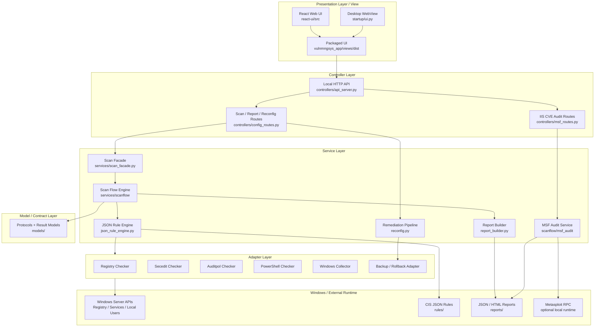
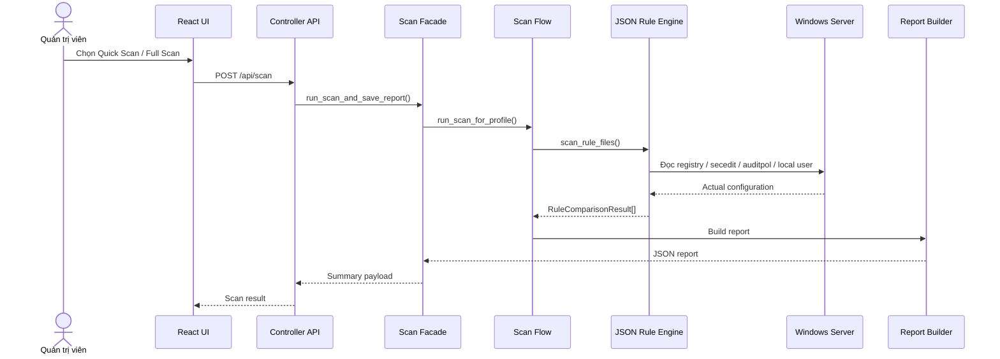
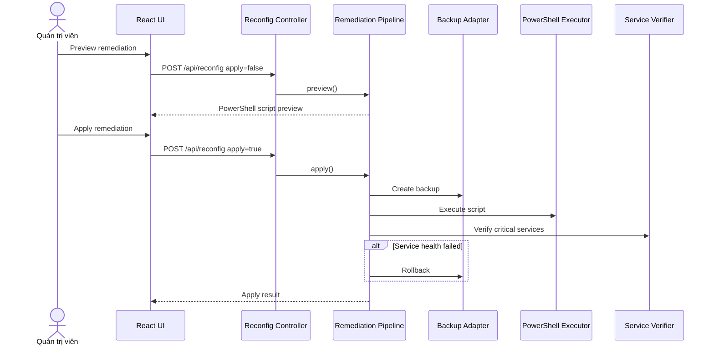
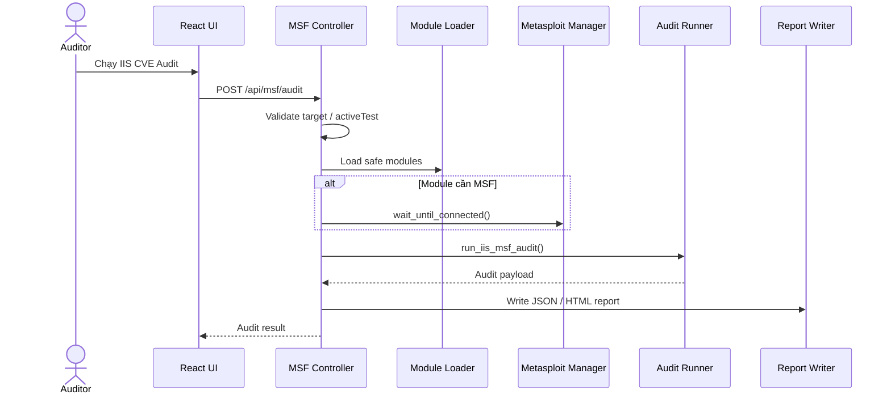
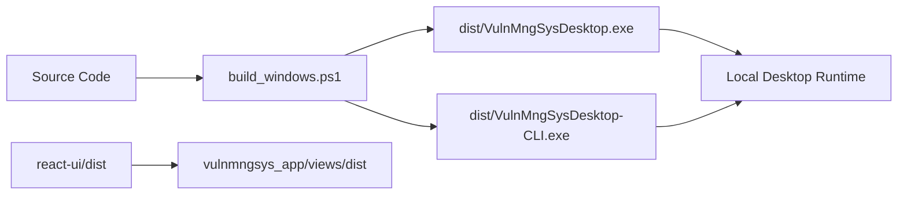

# Tổng Quan Kiến Trúc Hệ Thống VulnMngSys

VulnMngSys là ứng dụng desktop chạy cục bộ trên Windows Server để rà quét cấu hình bảo mật, đối chiếu rule CIS, sinh báo cáo và hỗ trợ preview/apply remediation có rollback.

## 1. Sơ Đồ Kiến Trúc Tổng Quan



## 2. Mô Hình MVC Đang Áp Dụng

| Thành phần MVC | Package / Module | Vai trò |
|----------------|------------------|---------|
| View | `react-ui/src`, `vulnmngsys_app/views/dist` | Giao diện người dùng, dashboard, gọi API nội bộ |
| Controller | `vulnmngsys_app/controllers` | Nhận HTTP request, validate quyền, gọi service |
| Model | `vulnmngsys_app/models` | Protocol, contract, dữ liệu kết quả scan |
| Service | `vulnmngsys_app/services` | Nghiệp vụ scan, report, remediation, MSF audit |
| Adapter | `vulnmngsys_app/adapters` | Tích hợp Windows: registry, secedit, auditpol, PowerShell, backup |
| Startup | `vulnmngsys_app/startup` | Entry point, khởi tạo UI/API, ghép dependency |

Root package `vulnmngsys_app` chỉ giữ `__init__.py`; logic không đặt ở root.

## 3. Luồng Rà Quét Cấu Hình



## 4. Luồng Remediation



## 5. Luồng IIS CVE Audit



## 6. Thành Phần Chính

| Thành phần | Trách nhiệm |
|------------|-------------|
| React UI | Hiển thị dashboard, kết quả scan, service tree, remediation, MSF audit |
| Local API | Cổng giao tiếp nội bộ giữa UI và backend |
| Scan Facade | Cung cấp API nghiệp vụ đơn giản cho controller |
| Scan Flow | Điều phối scan theo profile Windows Server |
| JSON Rule Engine | Đọc rule, lấy actual value, so sánh expected/actual |
| Report Builder | Chuẩn hóa kết quả và sinh report |
| Remediation Pipeline | Preview/apply script, backup, rollback |
| MSF Audit | Kiểm tra IIS CVE bằng local check và Metasploit RPC |
| Adapters | Đóng gói chi tiết Windows-specific |

## 7. Nguyên Tắc Thiết Kế

- **Single Responsibility:** mỗi layer chỉ xử lý đúng việc của nó.
- **Low Coupling:** UI không gọi trực tiếp service; controller không xử lý Windows API.
- **High Cohesion:** scan, report, remediation, MSF audit tách thành service riêng.
- **Dependency Inversion:** service làm việc qua model/protocol; startup ghép implementation cụ thể.
- **Windows Server only:** không giữ nhánh Linux/headless trong kiến trúc chính.

## 8. Artifact Build / Runtime



Output build chuẩn hiện tại nằm trong:

```text
D:\VulnMngSys\VulnMngSys\dist
```

## 9. Kết Luận Kiến Trúc

Hệ thống hiện được tổ chức theo MVC mở rộng:

- View: React/WebView.
- Controller: local HTTP route.
- Model: protocol và result model.
- Service: nghiệp vụ chính.
- Adapter: tích hợp Windows.
- Startup: composition root.

Cách chia này phù hợp để bảo vệ vì giải thích được luồng nghiệp vụ, điểm mở rộng, dependency direction và giới hạn phạm vi Windows Server.
